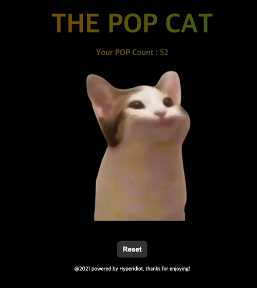

요즘 뜨고있는 pop cat을 컨트롤할 수 있는 애플리케이션을 만들어봤다.

**그냥 귀여워서 만들었다.**

코딩을 시작하면서 느낀 점이 있는데, 참 놀랍다. 만들고 싶다고 생각한 걸 눈에 보이는 아웃풋으로 변환할 수 있다니..
단순히 컴퓨터와 키보드만 있다면 내 아이디어를 실현시킬 수 있는 것이다.

이번에는 이벤트 제어를 메인으로, 사용해본 적 없는 keydown 이벤트를 사용해봤다. 모바일 지원을 위해 touchstart / touchend 기능도 사용해봤으나 원활하게 작동하지는 않는 듯 하다. (뭐가 문제인지 모르겠음)

역시 작은 요소라도 하나씩 만들어보는 게 기억에는 가장 잘 남지 않나 싶다.
앞으로 꾸준히 이런 작은 요소들을 만들어보면서 각 코어기능들을 조금 더 공부할 수 있도록 해보려 한다.

