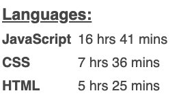
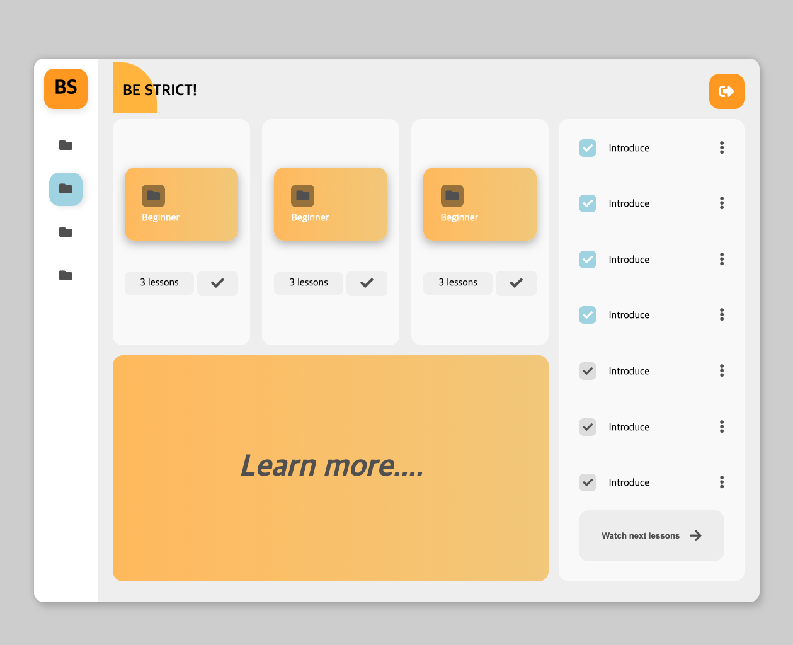
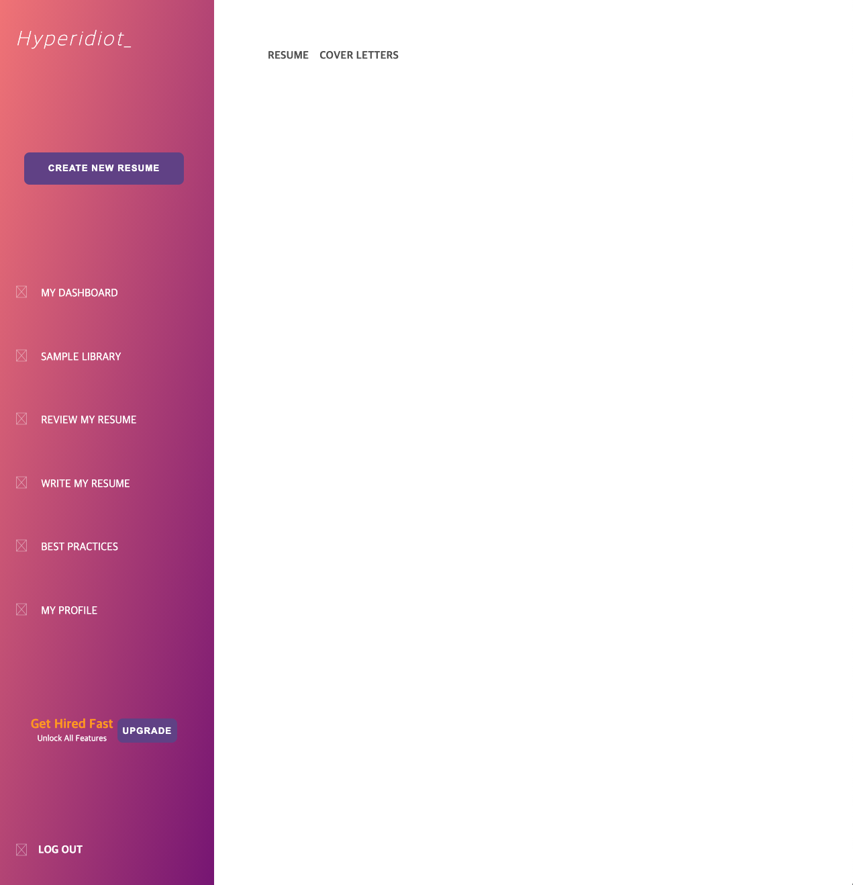

최근 자바스크립트에만 너무 열심인 것 같아, CSS 레이아웃을 몇개 만들었다.

웹은 결국 HTML,CSS,JS 삼박자가 고루 맞지 않으면 제대로 된 결과물을 만들 수 없다.

사실 아직도 세 언어에 대해서는 배울 것이 엄청 많이 남아있는데, 자바스크립트의 인터랙션을 위한 최소한의 CSS만 사용하고 그 외 제대로 된 스타일링을 해본 적은 없는 듯 하다.

1주일간 어떤 언어에 어느정도의 시간을 투자했는지 보여주는 `WakaTime`의 대시보드를 확인해보니, 내가 생각했던 것보다 시간차가 많이 나기에 당황했다.

HTML과 CSS에 저정도 시간이 들어간 것도 기본적 스타일링조차 미숙하기 때문이리라.

그래서 [Dribbble](https://dribbble.com/)과 [Pinterest](https://www.pinterest.co.kr/) 사이트에 올라와 있는 몇가지 ui를 보고 클론해봤다.

 

위 두 레이아웃을 만들 때는 모든 컴포넌트를 Flexbox를 이용해서 배치했는데, 특정 부분은 Grid가 나은 걸 알면서도 Grid의 사용법을 몰라 울며 겨자먹기로 플렉스를 사용했다.

다음엔 Grid를 이용해서 레이아웃을 배치해보고, 실제 간단한 기능을 하는 앱을 하나 만들어볼까 한다. 현재 구상중인건 명상? 화이트노이즈? 어플.

오디오 이벤트 관련해서는 팝캣을 만들 때 일부 습득한 지식이 있으니, 복습 겸 해볼까 싶다.

마지막으로 굉장히 단순한데 매우 예쁜 기법을 알게 됐는데, 바로 `Parallax Effect`다.

배경은 멀리, 글씨는 가까이에 있는 것 처럼 보이게 하는 기법이라고 한다.

웹에서 보면 아래와 같은 모습이다.

가끔 특정 웹사이트에서 이런 기법을 몇군데 봤었는데, 이게 어떤 효과인지 모르니 찾아 볼 수도 없었지...

어떻게 구현하는건지 알게 되서 기쁘다.

생각보다 굉장히 단순하게 적용 가능해서, 실용성이 매우 높아보인다. 그렇다고 남발할 수는 없겠지만.