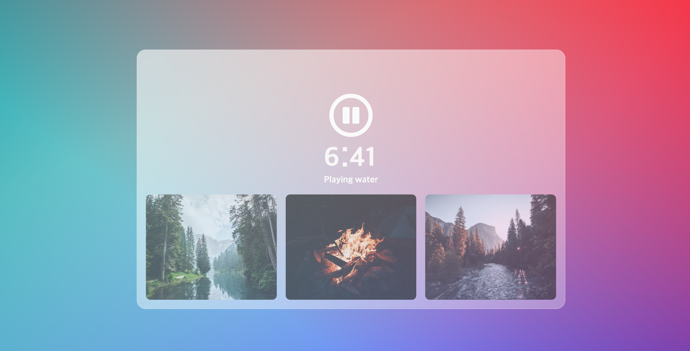

화이트 노이즈 어플을 만들어 보았다.

사운드 제어 이벤트 관련 및 forEach / this에 조금 더 익숙해지기 위해서 만들어보았다.

여기서 HTMLCollection을 제어할 수 있는 Attribute인 data-name에 대해서 알게 됐고,

HTML상의 div와 audio의 라벨을 바인딩함으로 div의 클릭 이벤트가 발생할 때, 바인딩 된 audio를 재생하게 했다.

추가적으로 audio.duration을 활용, 남은 시간을 텍스트로 띄우고, 인터벌로 매초마다 업데이트하게 설정하였다.

난항을 겪었던 부분은 다중재생이었는데, 다른 오디오가 재생중일 때에는 클릭 이벤트가 발생하지 않도록(혹은 발생하면 현재 플레이하는 오디오를 멈추고 타 오디오를 재생하도록) 하고 싶었다.

기능 구현 자체는 성공했는데, 문제는 2번 이상의 이벤트가 발생했을 때 재생/정지버튼이 정상작동을 안한다는 것이었다.

별로 맘에 들지는 않는데, 추후 다시 고쳐봐야겠다. 아직은 어떤 식으로 접근해야하는지 잘 모르겠다.